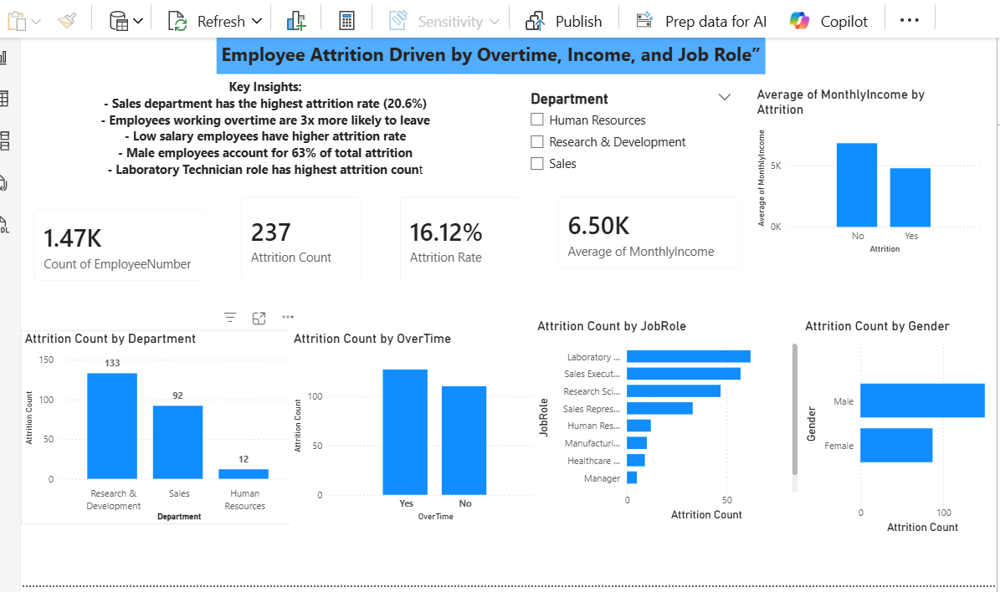

# 📊 Power BI Dashboard

# Tools Used
- SQL (SQLite Online)
- Python (Google Colab)
- Excel (Pivot Tables)
- Power BI (Dashboard)

# Files
- `HR_analysis.sql` — 10 SQL Queries
- `HR_analysis_python.ipynb` — Python EDA
- `WA_Fn-UseC_-HR-Employee-Attrition.xlsx` — Excel Analysis
- `Screenshot 2026-05-04 121203.png` — Power BI Dashboard
